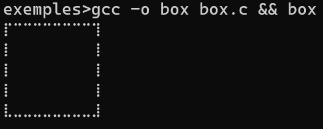

# Terminal Canvas
Terminal Canvas is a C library that uses braille  
to display pixel on the terminal. **WORK IN PROGRESS**
## Quickstart
```bash
> make.bat
```
## Exemples
```c
#include <math.h>
#include <stdio.h>
#include <stdlib.h>
#include <stdint.h>

#include "../include/term_canvas.h"

int main(void)
{
	struct Canvas canvas = new_canvas(20, 20);
	set_terminal_mode();
	for (size_t y = 0; y < 20; ++y) {
		for (size_t x = 0; x < 20; ++x) {
			if ((x == 0 || x == 19) || (y == 0 || y == 19))
			set_pixel(canvas, x, y, 1);
		}
	}
	draw_canvas(canvas);
	free_canvas(canvas);
	return 0;
}
```

The docs can be found [here](./docs/docs.md)!
